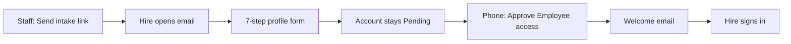

# Enrolling users in LORO

How a new person gets a LORO account: you send a link, they fill their profile, a manager approves on the phone, then they sign in.

**Who this is for:** admin, owner, manager, or HR.

**Web:** [https://loro.co.za/staff](https://loro.co.za/staff)

---

## The whole process

| Who | What they do |
|-----|----------------|
| You (HR / admin) | Send the intake link from Staff |
| The new hire | Fill the form. No LORO login yet. |
| A manager | Approve **Employee access** on the LORO phone app |
| The new hire | Sign in with the email and password they chose |

Until approval, they cannot sign in. After approval they use the same login on web and on the app.

---

## Path 1 — new hire fills their own form (use this)

This is the normal way to enroll someone.

### You — send the link (~2 minutes)

1. Sign in at [https://loro.co.za](https://loro.co.za).
2. Open **Staff**.
3. Click **Send intake link**.
4. **Send via**
   - **Email** — they get the link in their inbox (needs their email).
   - **Copy link only** — you paste the URL yourself (WhatsApp, SMS, printed).
   - WhatsApp from LORO is not available yet.
5. Enter their email. If you chose Email, this is required. The form then locks that address so they cannot change it.
6. Choose **access level** (usually **User**) and **workforce type**.
7. Choose **branch** — required.
8. Click **Create link**.
9. If you chose copy-link, click **Copy link** and send it to them.

The link looks like:

`https://loro.co.za/employee-intake?token=…`

It expires in 30 days unless you change that. Open links sit under **Pending intake links** on Staff until they finish.

### Them — fill the form

They do **not** need a LORO login. They open the link on a phone or computer.

| Step | What they enter |
|------|-----------------|
| 1. Account | First name, surname, email, phone, password (8+ characters, upper, lower, number) |
| 2. Personal | Gender, date of birth, country, national ID and/or passport |
| 3. Address | Street, city, and the rest of the address |
| 4. Health | Optional medical / lifestyle fields |
| 5. Contacts | Bank, next of kin, emergency, dependants (as applicable) |
| 6. Employment | Work phone, work email, start date |
| 7. Review | Check the summary, attach files if needed, tick consent, submit |

Useful details to tell them:

- Dates can be typed as **DD/MM/YYYY** (for example `12/05/1998`). They do not have to click month by month.
- Country changes the ID and bank rules. South Africa expects a 13-digit ID and a 6-digit branch code. Other countries accept a national ID (4–20 letters or digits) or a **passport** (5–15 letters or digits).
- Progress is saved on **that device**. Password is not stored in the draft — they type it again before submit if they come back later.
- Files (ID, contract) must be **under 5MB**.
- After submit they wait. A manager still has to approve.

### Manager — approve on the phone

1. Open the **LORO** app.
2. Open **Approvals**.
3. Open the **Employee access** item.
4. Check the profile snapshot.
5. **Approve** — status becomes Active and they get a welcome email.
6. **Reject** only if they should not have access — status becomes Declined and sign-in is blocked.

Owner and admin can always act. Other managers act when they are assigned **Employee access** as an approvable type.

### Them — sign in

They wait for the email that says they can sign in, then:

- Web: [https://loro.co.za/sign-in](https://loro.co.za/sign-in)
- Same email and password on the mobile app

---

## Path 2 — you create the account yourself

Use **Add user** when you want to set targets, branches, and client assignments yourself (existing staff, or you are not using the self-serve form).

1. Staff → **Add user**.
2. **Account** — name, surname, email, phone.
3. **Access** — access level, workforce type, branch.
4. **Targets** — optional sales / activity targets.
5. **Assignments** — optional managed staff, clients, extra branches.
6. Finish. LORO creates the Clerk login, syncs the profile, and emails sign-in instructions.

There is **no** phone approval step on this path.

If they already appear on Staff but cannot sign in:

- Settings → **Invite User** if Clerk is not linked yet (badge **Pending sign-in**).
- Settings → **Re-Invite User** if they are already linked and need the email again.

---

## What to send the hire (copy/paste)

> Please complete your LORO employee profile using the link in this email (or the link I pasted).
>
> You do not need an account yet. Open the link, go through the seven steps, and submit. Type dates as DD/MM/YYYY. You can use a national ID or a passport.
>
> After you submit, wait for an approval email. Then sign in at https://loro.co.za/sign-in with the password you chose. The same login works on the LORO app.

---

## If something fails

| What they see | What you do |
|---------------|-------------|
| No email arrived | Staff → **Pending intake links** → **Resend**. That makes a new token, emails it, and copies the URL. |
| Link expired or already used | Send a **new** intake link. Old tokens cannot be reused after submit. |
| “Unable to open form” / missing token | They must open the full URL with `?token=…`, not `/employee-intake` on its own. |
| Email already registered | Do not use intake. Use **Add user** or **Re-invite** on their settings page. |
| Submitted but cannot sign in | Approval is still pending. Approve **Employee access** on the phone. |
| WhatsApp greyed out | Not available yet. Use Email or Copy link only. |
| Draft “lost” | Draft lives on that browser/device only. Same link on a new phone starts empty (password is never restored). |

---

## Quick demo (if you are showing someone)

About **8 minutes**. One hire. Do **not** use Add user unless you are showing Path 2.

| Time | You say | You click |
|------|---------|-----------|
| 0:00 | They fill their own profile. You only send a link. | Staff page |
| 0:30 | Five moves: send → fill → pending → approve on phone → sign in. | Point at the flow |
| 1:30 | Branch and access are yours. They never pick those. | **Send intake link** → Email → Create link |
| 3:30 | Seven steps, type dates, ID or passport, then wait. | Open the link in a private window |
| 6:00 | Approval is on the phone, not on this Staff grid. | App → Approvals → **Employee access** → Approve |
| 7:00 | Same password on web and app. | `/sign-in` |
| 7:30 | Resend lives under Pending intake links. | Point at the pending table |

Skip Health, insurance, and file upload unless someone asks.

---

*LORO / Legend Systems — employee enrollment. For access-level questions, ask an org admin.*
